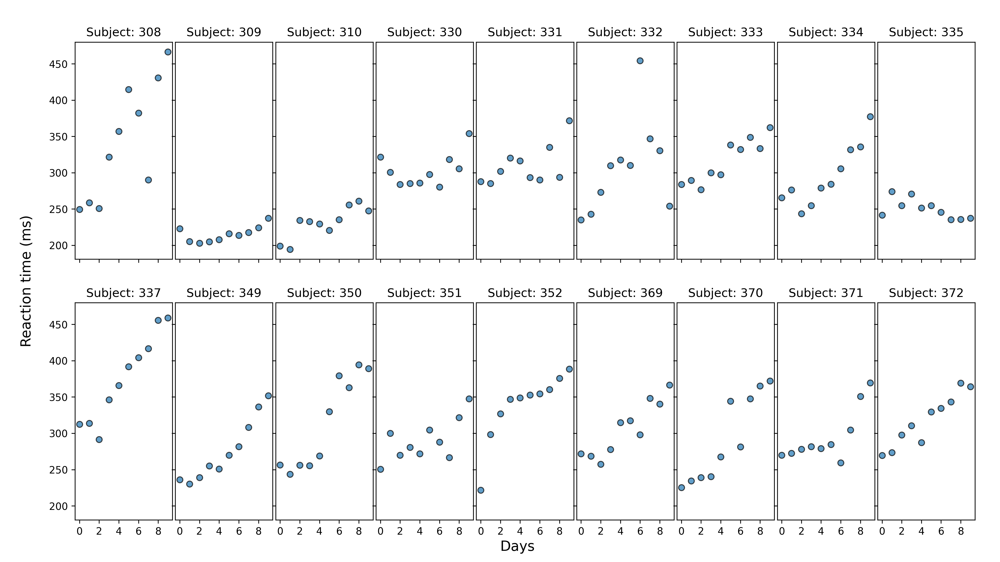
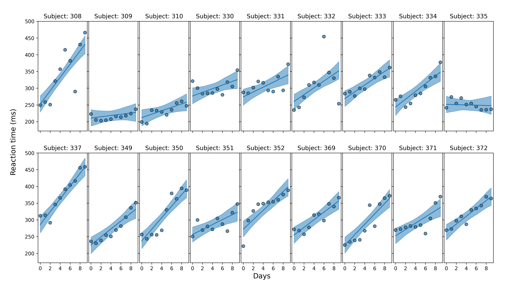

```{r plots-setup, include=FALSE}
knitr::opts_chunk$set(fig.align = "center")
knitr::opts_chunk$set(warning = FALSE)
```


```{r r-setup, include=FALSE}
library(reticulate)
use_condaenv("bmb", required = TRUE)
```

# Outline

--

* .font150[What is Bambi?]

<!-- Bambi, bayesian modelling, libraries Bambi rely on. -->

--

* .font150[How Bambi can help me?]

--

* .font150[Examples]

--

* .font150[Get involved]

---

# What is Bambi

--

* .font120[A high-level interface for Bayesian modeling built on top of **PyMC3** and **ArviZ**]

--

* .font120[Allows practioners to specify, build, and fit Generalized Linear Mixed Models (GLMMs) with few lines of code] 
  + Linear regression
  + Logistic regression
  + Hierarchical models
  + More!

--

* Another one?


<!-- -- What do I need to use Bambi? -->

---

# Examples


## Example 1: Sleep deprivation study

```{python}
import arviz as az
import bambi as bmb
import matplotlib.pyplot as plt
```

```{python}
data = bmb.load_data("sleepstudy")
data.head()
```


```{python, echo = FALSE, message = FALSE, results="hide"}
fig, axes = plt.subplots(2, 9, figsize=(14, 7.875), sharey=True, sharex=True)
fig.subplots_adjust(left=0.075, right=0.975, bottom=0.075, top=0.925, wspace=0.03)

axes = axes.ravel()

for i, subject in enumerate(data["Subject"].unique()):
    ax = axes[i]
    idx = data.index[data["Subject"] == subject].tolist()
    days = data.loc[idx, "Days"].values
    reaction = data.loc[idx, "Reaction"].values

    # Plot observed data points
    ax.scatter(days, reaction, color="C0", ec="black", alpha=0.7)

    # Add a title
    ax.set_title(f"Subject: {subject}")

ax.xaxis.set_ticks([0, 2, 4, 6, 8])
fig.text(0.5, 0.02, "Days", fontsize=14)
fig.text(0.02, 0.5, "Reaction time (ms)", rotation=90, fontsize=14, ha="left", va="center")
fig.savefig("plots/data.png", dpi = 300)
```

---

# Examples

```{r, echo=FALSE, out.width = "85%"}

```

---

# Examples

```{python}
model = bmb.Model("Reaction ~ Days + (Days | Subject)", data)
model
```

---

# Examples

```{python}
idata = model.fit()
```

---

# Examples

```{r, echo=FALSE, results="asis"}
cat(paste0("<div style='font-size:70%'>", py$idata$`_repr_html_`(), "</div>"))
```

---

# Examples


```{python, echo = FALSE, message = FALSE, results="hide"}
fig, axes = plt.subplots(2, 9, figsize=(14, 7.875), sharey=True, sharex=True)
fig.subplots_adjust(left=0.075, right=0.975, bottom=0.075, top=0.925, wspace=0.03)

axes = axes.ravel()

# Generate predictions for in-sample data
model.predict(idata)

# Take the posterior of the mean reaction time
reaction_mean = idata.posterior["Reaction_mean"].values

for i, subject in enumerate(data["Subject"].unique()):
    ax = axes[i]
    idx = data.index[data["Subject"] == subject].tolist()
    days = data.loc[idx, "Days"].values
    reaction = data.loc[idx, "Reaction"].values
  
    # Plot highest density interval
    az.plot_hdi(days, reaction_mean[:, :, idx], color="C0", ax=ax)

    # Plot predicted regression equation
    ax.plot(days, reaction_mean[:, :, idx].mean(axis=(0, 1)), color="C0")
  
    # Plot observed data points
    ax.scatter(days, reaction, color="C0", ec="black", alpha=0.7)

    # Add a title
    ax.set_title(f"Subject: {subject}")

ax.xaxis.set_ticks([0, 2, 4, 6, 8])
fig.text(0.5, 0.02, "Days", fontsize=14)
fig.text(0.02, 0.5, "Reaction time (ms)", rotation=90, fontsize=14, ha="left", va="center")
fig.savefig("plots/posterior.png", dpi = 300)
```


```{r, echo=FALSE, out.width = "85%"}

```