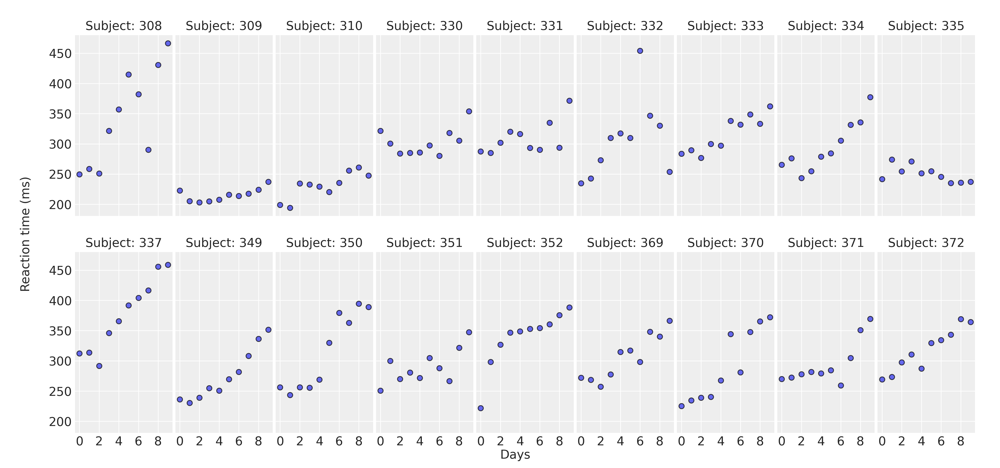

```{r plots-setup, include=FALSE}
knitr::opts_chunk$set(fig.align = "center")
knitr::opts_chunk$set(warning = FALSE)
```


```{r reticulate-setup, include=FALSE}
library(reticulate)
use_condaenv("bmb", required = TRUE)
```

```{r icons-setup, include=FALSE}
library(icons)
twitter_icon <- icon_style(fontawesome$brands$twitter, scale = 1, fill="#1d9bf0")
github_icon <- icon_style(fontawesome$brands$github, scale = 1)
```

```{r dev-variables, include=FALSE}
eval_code <- TRUE
```

# Outline

--

* .lh2[.font190[What is Bambi?]]

--

* .lh2[.font190[Examples]]

--

* .lh2[.font190[Conclusions]]

--

* .lh2[.font190[Get involved]]


---

# What is Bambi

* .font120[**Bambi:** BAyesian Model-Building Interface]

--

* .font120[Built on top of **PyMC** and **ArviZ**]

--

### Main features

--

* Supports Generalized Linear Mixed Models (GLMMs)

--

* Has a short and simple model specification syntax
  + Write less code, save time.

--

* Supports both numerical and categorical predictors without asking users to perform complicated data preparation steps
  + Prevents errors, saves debugging time.

--

* Automatic computation of default priors
  + Makes it faster to do iterative model building. Still allows to specify custom priors

--

* Gives you access to the underlying PyMC model

<!-- --- -->

<!-- # What is Bambi -->

<!-- ### Model syntax -->

<!-- Like R, Bambi adds an implicit intercept that can be suppressed with `0` or `-1`. -->

---

# Examples

```{python, include=FALSE}
import arviz as az
import bambi as bmb
import matplotlib.pyplot as plt
import matplotlib.lines as lines
import numpy as np
import pandas as pd
```

```{python, include=FALSE}
az.style.use("arviz-darkgrid")
```


## Example 1: Vote probability estimation

```{python}
data = bmb.load_data("ANES")
data.head()
```

.lh-2[
* **vote**: Who would you vote in the 2016 presidential election? 
  + `"clinton"`, `"trump"`, and `"someone_else"`
* **age**: Age of the respondent. Ranges from 18 to 95.
* **party_id**: With which US political party does the respondent usually identify? 
  + `"democrat"`, `"republican"`, `"independent"`
]

---

# Example 1: Vote probability estimation

* All models in Bambi are created with the `Model` class
  + `formula`
  + `data`
  
```{python, eval=eval_code}
model = bmb.Model("vote[clinton] ~ 0 + party_id + party_id:age", data, family="bernoulli")
model
```


* Printing the `Model` instance gives us a summary of the model
  + Bambi has chosen default priors for us


---
# Example 1: Vote probability estimationy

```{python, eval=FALSE}
idata = model.fit()
```

```{python, echo=FALSE, eval=eval_code}
idata = model.fit(tune=2000, target_accept=0.85)
```


* This returns an `InferenceData` object from the **ArviZ** library.
* Additional sampling information is printed by the **PyMC** sampler.

---
# Example 1: Vote probability estimation

```{python, eval=eval_code}
new_subjects = pd.DataFrame({"age": [20, 60], "party_id": ["independent"] * 2})
model.predict(idata, data=new_subjects)
```


```{python, echo=FALSE, message=FALSE, results="hide", eval=eval_code}
values = idata.posterior.vote_mean.values

fig, ax = plt.subplots(figsize=(9, 6))

for idx in range(values.shape[2]):
    x = values[:, :, idx]
    plot_kwargs = {"color": f"C{idx}", "label": f"Subject {idx}"}
    az.plot_kde(x, plot_kwargs=plot_kwargs, ax=ax)

ax.set_xlabel("P(vote = clinton)")
ax.set_ylabel("Density function");

fig.savefig("plots/logistic_posterior_1.png", dpi = 300)
```


```{r, echo=FALSE, out.width="60%"}

```

---
# Example 1: Vote probability estimation

```{python, echo=FALSE, message=FALSE, results="hide", eval=eval_code}
# Create new dataset
age = np.arange(18, 91)
new_data = pd.DataFrame({
    "age": np.tile(age, 3),
    "party_id": np.repeat(["democrat", "republican", "independent"], len(age))
})

# Predict for the new dataset
model.predict(idata, data=new_data)

# Compute mean across chains
posterior_mean = idata.posterior["vote_mean"].values.mean(0)

# Select 1000 draws
posterior_mean = posterior_mean[::2, :]

# Create plots
fig, ax = plt.subplots(figsize=(9, 6))

parties = ["democrat", "republican", "independent"]
handles = []
for i, party in enumerate(parties):
    idx = new_data.index[new_data["party_id"] == party].tolist()
    handles += [lines.Line2D([], [], label=party, color=f"C{i}", lw=2)]
    ax.plot(age, posterior_mean[:, idx].T, alpha=0.02, color=f"C{i}")

# Create legend
PAD = 0.025
ax.legend(
    handles=handles,
    loc="lower right",
    bbox_to_anchor=(1, 1 + PAD / 2),
    fontsize=10,
    frameon=True,
    framealpha=0.4,
    ncol=len(handles),
    borderaxespad=0,
    labelspacing=0.2,
    columnspacing=1.2,
    handletextpad=0.8
)

ax.set_ylabel("P(vote=clinton | age)")
ax.set_xlabel("Age", fontsize=15)
ax.set_ylim(0, 1)
ax.set_xlim(18, 90)

fig.savefig("plots/logistic_posterior_2.png", dpi=300)
```

```{r, echo=FALSE, out.width="70%"}

```

---

# Example 1: PyMC version

```{python, eval=FALSE}
party_idx, parties = pd.factorize(data["party_id"])
coords = {"name": list(parties)}

with pm.Model(coords=coords) as model:
    # Party intercepts
    party = pm.Normal("party", mu=0, sigma=5, dims="name")
    
    # Age slope, for each party
    age = pm.Normal("age", mu=0, sigma=0.1, dims="name")
    
    # Linear predictor
    nu = party[party_idx] + age[party_idx] * data.age.values
    
    # Convert to probability
    p = pm.math.sigmoid(nu)
    
    # Likelihood
    pm.Bernoulli("p", p = p, observed=data.vote.values == "clinton")
    
    # Fit model
    idata = pm.sample(draws=2000, target_accept=0.85, return_inferencedata=True)
```

---

# Examples

## Example 2: Sleep deprivation study

<!-- In this example we are going to use sleepstudy dataset. It is derived from
the study described in Belenky et al. (2003) and popularized in the lme4 R 
package. This dataset contains the average reaction time per day 
(in milliseconds) on a series of tests for the most sleep-deprived group in a 
sleep deprivation study. The first two days of the study are considered as 
adaptation and training, the third day is a baseline, and sleep deprivation 
started after day 3. The subjects in this group were restricted to 3 hours of 
sleep per night. -->

<!-- 18 people -->
<!-- 3 hours of sleep -->
<!-- Mean reaction time on several tasks -->
<!-- Day 0-1: Adaptation, training -->
<!-- Day 2: baseline -->
<!-- Day 3-9: Sleep deprivation -->


```{python}
data = bmb.load_data("sleepstudy")
data.head()
```

<br>

.lh-2[
* **Reaction**: Average of the reaction time measurements on a given subject for a given day.
* **Days**: Number of days of sleep deprivation.
* **Subject**: The subject ID
]


---

# Example 2: Sleep deprivation study

```{python, echo=FALSE, message=FALSE, results="hide", eval=eval_code}
fig, axes = plt.subplots(2, 9, figsize=(16, 7.5), sharey=True, sharex=True)
fig.subplots_adjust(left=0.075, right=0.975, bottom=0.075, top=0.925, wspace=0.03)

axes = axes.ravel()

for i, subject in enumerate(data["Subject"].unique()):
    ax = axes[i]
    idx = data.index[data["Subject"] == subject].tolist()
    days = data.loc[idx, "Days"].values
    reaction = data.loc[idx, "Reaction"].values

    # Plot observed data points
    ax.scatter(days, reaction, color="C0", ec="black", alpha=0.7)

    # Add a title
    ax.set_title(f"Subject: {subject}", fontsize=14)

ax.xaxis.set_ticks([0, 2, 4, 6, 8])
fig.text(0.5, 0.02, "Days", fontsize=14)
fig.text(0.02, 0.5, "Reaction time (ms)", rotation=90, fontsize=14, ha="left", va="center")
fig.savefig("plots/sleepstudy_data.png", dpi = 300)
```


```{r, echo=FALSE, out.width = "95%"}

```

---

# Example 2: Sleep deprivation study

```{python, eval=eval_code}
model = bmb.Model("Reaction ~ Days + (Days | Subject)", data)
model
```

```{python, message=FALSE, results="hide", eval=eval_code}
idata = model.fit(draws=4000)
```

---
# Example 2: Sleep deprivation study


```{python, echo=FALSE, message=FALSE, results="hide", eval=eval_code}
fig, axes = plt.subplots(2, 2, figsize=(16, 7))
az.plot_trace(idata, var_names=["1|Subject", "Days|Subject"], backend_kwargs={"constrained_layout": True}, axes=axes)
fig.savefig("plots/sleepstudy_trace.png", dpi=300)
```


```{python, eval=FALSE}
az.plot_trace(idata, var_names=["1|Subject", "Days|Subject"])
```


```{r, echo=FALSE, out.width = "90%"}
knitr::include_graphics("plots/sleepstudy_trace.png")
```

---

# Example 2: Sleep deprivation study

```{python, echo=FALSE, message=FALSE, results="hide", eval=eval_code}
fig, axes = plt.subplots(2, 9, figsize=(16, 7.5), sharey=True, sharex=True)
fig.subplots_adjust(left=0.075, right=0.975, bottom=0.075, top=0.925, wspace=0.03)

axes = axes.ravel()

# Generate predictions for in-sample data
model.predict(idata)

# Take the posterior of the mean reaction time
reaction_mean = idata.posterior["Reaction_mean"].values

for i, subject in enumerate(data["Subject"].unique()):
    ax = axes[i]
    idx = data.index[data["Subject"] == subject].tolist()
    days = data.loc[idx, "Days"].values
    reaction = data.loc[idx, "Reaction"].values
  
    # Plot highest density interval
    az.plot_hdi(days, reaction_mean[:, :, idx], color="C0", ax=ax)

    # Plot predicted regression equation
    ax.plot(days, reaction_mean[:, :, idx].mean(axis=(0, 1)), color="C0")
  
    # Plot observed data points
    ax.scatter(days, reaction, color="C0", ec="black", alpha=0.7)

    # Add a title
    ax.set_title(f"Subject: {subject}", fontsize=14)

ax.xaxis.set_ticks([0, 2, 4, 6, 8])
fig.text(0.5, 0.02, "Days", fontsize=14)
fig.text(0.02, 0.5, "Reaction time (ms)", rotation=90, fontsize=14, ha="left", va="center")
fig.savefig("plots/sleepstudy_posterior.png", dpi = 300)
```


```{r, echo=FALSE, out.width = "95%"}

```

---
# Example 2: PyMC version

```{python, eval=FALSE}
subject_idx, subjects = pd.factorize(data["Subject"])
coords = {"subjects": list(subjects)}
with pm.Model(coords=coords) as model:
    # Intercepts
    intercept_mu = pm.Normal("intercept_mu", mu=0, sigma=200)
    intercept_sigma = pm.HalfNormal("intercept_sigma", sigma=200)
    intercept_offset = pm.Normal("intercept_offset", dims="subjects")
    intercept = pm.Deterministic("intercept", intercept_mu + intercept_sigma * intercept_offset)
    
    # Slopes
    days_mu = pm.Normal("days_mu", mu=0, sigma=50)
    days_sigma = pm.HalfNormal("days_sigma", sigma=50)
    days_offset = pm.Normal("days_offset", dims="subjects")
    days = pm.Deterministic("days", days_mu + days_sigma * days_offset)
  
    # Mean and SD of the normal distribution
    mu = intercept[subject_idx] + days[subject_idx] * data.Days.values
    sigma = pm.HalfStudentT("sigma", nu=4, sigma=50)
    
    # Likelihood
    reaction = pm.Normal("reaction", mu=mu, sigma=sigma, observed=data.Reaction.values) 
    
    # Fit model
    idata_pm = pm.sample(draws=4000, return_inferencedata=True)
```

---

# Conclusions

**Highlights**

* .lh2[.font150[Simple syntax]]

* .lh2[.font150[Less error-prone]]

* .lh2[.font150[Still flexible]]
  + Not as flexible as PyMC, of course.
  
* .lh2[.font150[Familiar if you come from the R programming language]]

* .lh2[.font150[Reduce cognitive load]]
  + Helps to focus on your problem

---

# Get involved

* Bambi is hosted and developed on `r github_icon`
  + Issues, Pull Requests, anything is welcomed!
  + [github.com/bambinos/bambi](https://github.com/bambinos/bambi)

* Our documentation webpage
  + [bambinos.github.io/bambi](https://bambinos.github.io/bambi)

* Reach out core developers in the brid platform `r twitter_icon`
  + Find Osvaldo Martin [@aloctavodia](https://twitter.com/aloctavodia)
  + Find me [@caprettotomas](https://twitter.com/CaprettoTomas)
  
---

class: inverse, center


